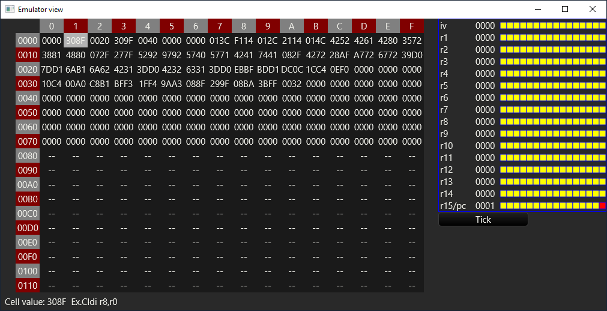

# asm for mc cpu

Simple toy assembly to machine code compiler and cpu emulator.
___
This compiler is designed to work from command line, take single text file
and produce binary or hexadecimal output.

[Assembly Language Specification](doc/assembly.md)

[Binary Instruction Representation](doc/binary_opcodes.md)

### Build / Installation
Building the package
```sh
$ git clone https://github.com/Kazik24/asm-for-mc-cpu.git
$ cd asm-for-mc-cpu
$ cargo build
```
Installing as cargo module
```sh
$ cargo install --git https://github.com/Kazik24/asm-for-mc-cpu.git
```
### Usage
Show help
```sh
$ asm-for-mc-cpu --help
```

Specify input file `-i FILE`

Specify output file `-o FILE`
You can use file with extensions:
* `.bin` to produce text file with binary representation of each instruction and comments, example shown below.
```text
0000: 0000 0000 0000 0000    Or r0,r0,r0
0001: 0011 0000 1000 1111    Ex.Cldi r8,r0
0002: 0000 0000 0010 0000    #0x0020
0003: 0011 0000 1001 1111    Ex.Cldi r9,r0
0004: 0000 0000 0100 0000    #0x0040
```
* `.hex` to produce text file with hexadecimal representation of each instruction.
* any other extension or lack of it will produce a binary file.

Compiling some file:
```sh
$ asm-for-mc-cpu -i my_file.asm -o compiled.bin
```

Run emulator window `-e NUMBER_OF_RAM_CELLS` will launch emulator window on compiled program with scrolable memory view,
register content view. You should specify number of ram cells to allocate for the emulator.

Example usage:
```sh
$ asm-for-mc-cpu -i my_code.asm -e 128
```
Will show emulator window with 128 cells of ram:
